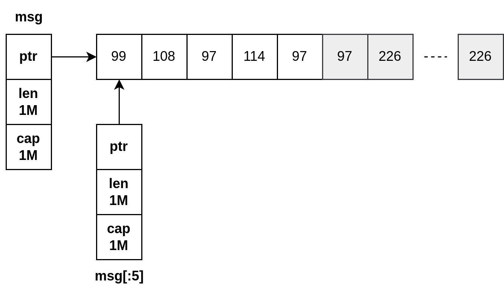

# 100 Go Mistake

Anyone who has never made a mistake has never tries anything new.

-- Albert Einstein

## 1. Unintended variable shadowing

The scope of a variable refers to the places a variable can be referenced. In Go, a variable name declared in a block may be re declared in an inner block. This called variable shadowing, is prone to common mistakes.

```go
func main() {
	var seted = false
	if true {
        // variable shadowing
		seted, err := fn()
		if err != nil {
		}
		log.Println(seted)
	} else {
        // variable shadowing
		seted, err := fn()
		if err != nil {
		}
		log.Println(seted)
	}

	log.Println(seted)
}

func fn() (bool, error) {
	return true, nil
}
```

Variable shadowing occurs when a variable name is re declared in an inner block, and we've seen that this practice is prone to mistakes

## 2. Misusing init functions

When a package is initialized, all the constants and variables declarations in the package are evaluated. Then, the init functions are executed.

**Anti pattern: to hold a database connection pool**

```go
var db *sql.DB
func init() {
    dataSourceName := os.Getenv("MYSQL_DATA_SOURCE_NAME")
    d, err := sql.Open("mysql", dataSourceName)
    if err != nil {
        log.Panic(err)
    }

    err = d.Ping()
    if err != nil {
        log.Panic(err)
    }
    db = d
}
```

**Let's describe three main downsides**

- Error management in an init function is limited, only ways to signal an error is to panic, leading application to be stopped
- init function will be executed before running the test cases
- Database connection pool is assigned to a global variable. Global variables have some severe drawbacks
+ Any functions can alter them within the package
+ It can also make unit test more complicated as a function that would depend on it 

**In summary, we have seen that init functions may lead to some issues:**

- Limit error management
- It can complicate how to implement tests
- If the initialization requires to set a state, it has to be done through global variables

## 3. Interface pollution

Interface pollution is about overwhelming our code with unnecessary abstractions making it harder to understand.
The bigger the interface, the weaker the abstraction

**When to use interfaces?**

- Common behavior
- Decoupling
- Restricting behavior

**Common behavior**
The first option we will discuss is to use interface when multiple types implement a common behavior. In such a case, we can factor out the behavior inside an interface.

```go
// Example, Interface in sort package
type Interface interface {
	Len() int
	Less(i, j int) bool
	Swap(i, j int)
}
```
Finding the right abstraction to factor out behavior can also bring many benefits.

**Decoupling**

If we rely on abstraction instead of a concrete implementation, the implementation itself can be replaceable with another without even having to change our code; this is the Liskov Substituition Principle.
One benefit of decoupling can be related to unit testing, for example.

```go
type CustomerService struct {
	store mysql.Store
}

func (cs CustomerService) CreateNewCustomer(id string) error {
	return cs.store.StoreCustomer(id)
}
```

Now, what if we want to test this method? As customerService relies on the actual implementation to store a Customer, we are obliged to test it through integration tests which require spinning up a MySQL instance. To give us more flexibility, we should decouple CustomerService from the actual implementation, which can be done via an interface:

```go
type customerStorer interface {
	StoreCustomer(string) error
}

type CustomerService struct {
	storer customerStorer
}

func (cs CustomerService) CreateNewCustomer(id string) error {
	return cs.store.StoreCustomer(id)
}
```

**Restricting behavior**

The last use case we will discuss can be pretty counter-intuitive at first sight. It's about restricting a type to a specific behavior.

```go
type IntConfig struct {
}

func (c *IntConfig) Get() int {}
func (c *IntConfig) Set(value int) {}
```

Now, suppose we receive an IntConfig that holds some specific configuration, such as a threshold. Yet, in our code, we are only interested in retrieving the config value, and we want to prevent updating it. How could we enforce that, semantically, this configuration is a read-only one if we don't want to change our configuration package?

```go
type intConfigGetter interface {
	Get() int
}
```

Then, in our code, we could rely on intConfigGetter instead of concrete implementation:

```go
type Foo struct {
	threshold intConfigGetter
}
func NewFoo(threshold intConfigGetter) Foo {
	return Foo{threshold: threshold}
}

func (f Foo) Bar() {
	threshold := f.threshold.Get()
}
```

**Interface pollution**

Create interfaces before concrete types shouldn't work in Go. As we discussed, interfaces are made to create abstractions. And the main caveat when programming meets abstractions is remembering that abstractions should be discovered, not created.

We shouldn't start by creating abstractions in our code if there is no immediate reason for it. We shouldn't design with interfaces but wait for a concrete need. We should create an interface when we need it, not when we foresee that we could need it.

What's the main problem if we overuse interfaces? The answer is that it makes the code flow more complex. Adding a useless level of indirection doesn't bring any value; it creates a useless abstraction making the code more difficult to read, understand and reason about.

If we don't have a strong reason for adding an interface and it's unclear how an interface makes a code better, we should challenge this interface's purpose. **Why not call the implementation directly?**

We can also not a performance overhead when calling a method through an interface. It requires a lookup in a hashtable data structure to find the concrete type it's pointing to. Yet, this isn't an issue an in many contexts as this overhead is minimal.

**Don't design with interfaces, discover them.**

## 4. Where should an interface live?

Some term should be clear

- Producer side: an interface defined in the same package as the concrete implementation
- Consumer side: an interface defined in an external package, where it's used

It's pretty common to see developers creating interfaces on the producer side, alongside the concrete implementation. This design is perhaps a habit from developers having a C# or a Java background. However, in Go, this is, in most cases, not what we should do.

We create a specific package to store and retrieve customer data. Meanwhile, we decide, still in the same package, that all the calls will have to go through the following interface:

```go
type CustomerStorage interface {
	Store(customer Customer) error
	Get(id string) Customer
	Update(customer Customer) error
	GetAll() ([]Customer, error)
	GetCustomersWithoutContract() ([]Customer, error)
	GetCustomersWithNegativeBalance() ([]Customer, error)
}
```

We might think we have some excellent reasons to create and expose this interface on the producer side. Perhaps it's a good way to decouple the client code from the actual implementation? 

Maybe another client wants to decouple his code but only interested in the GetAllCustomers method.

```go
package client

type customerGetter interface {
	GetAllCustomers() ([]store.Customer, error)
}
```
## 5. Returning interface

While designing a function signature, we may have to either return and interface or a concrete implementation. Let's understand why returning an interface is, in many cases, considered a bad practice in Go.

```go
package client

type Store interface {}
```

```go
package store

// InMemoryStore
type InMemoryStore struct {
}

func NewInMemoryStore() client.Store {
}
```
**Problems:** cyclic dependency 

In most cases, we can get inspiration from Postel's law:

Be conservative in what you do, be liberal in what you accept from others

If we apply this idiom to Go, it means:

- Returning struct instead of interfaces
- Accepting interfaces if possible

We shouldn't return interfaces but concrete implementations. Otherwise, it can make our design more complex due to package dependencies and restrict flexibility as all the clients would have to rely on the same abstraction. If we know than an abstraction will be helpful for clients, we can consider returning an interface. Otherwise, we shouldn't force abstractions, they should be discovered by clients. If a client needs to abstract an implementation for whatever reason, it can still do it on his side. 


## 6. Not being aware of the possible problems with type embedding

Let's see an example of a wrong usage. We will implement a struct that will hold some in-memory data, and we want to protect it against concurrent accesses using a mutex:

```go
type InMem struct {
	sync.Mutex
	m map[string]int
}

func New() *InMem {
	return &InMem{m: make(map[string]int)}
}

func (i *InMem) Get(key string) (int, bool) {
	// As the mutex is embedded, we can directly access the Lock and Unlock methods from
	// the i receiver
	i.Lock()
	v, contains := i.m[key]
	i.Unlock()

	return v, contains
}

func main() {
	m := inmem.New()
	// sync.Mutex is an embedded type, the Lock and Unlock methods will be promoted
	m.Lock() // ??
}

```

Let's see another example, but this time, embedding can be considered a correct approach. We want to write a customer logger that would contain an io.WriteCloser and expose two methods: Write and Close. If io.WriterClose isn't embedded, we would have to write it like so:

```go
type Logger struct {
	writerCloser io.WriteCloser
}

func (l Logger) Write(p []byte) (int, error) {
	return l.writerCloser.Write(p)
}

func (l Logger) Closer() error {
	return l.writerCloser.Closer()
}
```

```go
type Logger struct {
	io.WriteCloser
}
```

Different embedding from OOP subclassing can sometimes be confusing. The main difference is related to who is the receiver of a method. Embedding is about composition, not inheritance.

What should we conclude about type embedding?

First, let's note that it's rarely a necessity, and it means that whatever the usecase, we can probably solve it as well without type embedding. It's mainly used for convenience, in most cases to promote behaviors.

If we decide to use type embedding, we have to keep two main constraints in mind:

- It shouldn't be solely because of some syntactic sugar to simplify accessing a field ( e.g Foo.Baz() instead of Foo.Bar.Bar() ). If it's the only rationale, let's not embed the inner type and use a field instead.

- It shouldn't promote data (fields) or a behavior (methods) we want to hide from outside. For example, if it allows clients to access a locking behavior that should have remained private to the struct.

One may also argue that using type embedding could lead to extra efforts in terms of maintenance in the context of exported structs. Indeed, embedding a type inside an exported struct means remaining cautions when this type evolves. For example, if we add a new method in the inner type, we should ensure it doesn't break the latter constraint. Hence, to avoid this extra effort, teams can also prevent type embedding in public structs.

## 7. Not understand slice length and capacity

In Go, slice is backed by an array. It means the slice's data are stored contiguously in an array data struct. A slice also handles the logic of adding an element if the backing array is full or how to shrink the backing array if almost empty.

Internally, a slice holds a pointer towards the backing array plus a length and a capacity. The length is the number of elements the slice contains, whereas the capacity is the number of elements in the backing array.

Nil slice doesn't require any allocation, we should favor returning a nil slice.

```go
func f() []string {
	var s []string
	if foo() {
		s = append(s, "foo")
	}
	return s
}
```

Initialize a slice depending on the context:

```go
// if we aren't sure about the final length and the slice can be empty
var s []string

// create a nil and empty slice
[]string(nil)

// if the future length is known
make([]string, length[, capacity])

// should be avoid
[]string{}
```

Nil slices are always empty. Therefore, checking by checking the length of the slice, we cover all the scenarios:

- If the slice is nil: len(operations) != 0 will be false
- If the slice isn't nil but empty: len(operations) != 0 will also be false

## 8. Slice and memory leaks

This section will show that slicing an existing slice or array can lead to memory leaks in some conditions. 

**Capacity leak**

```go
package main

import (
	"log"
	"net/http"
	_ "net/http/pprof"
)

func main() {
	// pprof: go tool pprof -http localhost:9000 http://localhost:8080/debug/pprof/heap
	go consumeMessages()

	http.ListenAndServe(":8080", nil)
}

func consumeMessages() {
	for {
		msg := receiveMessage()
		// Do something with msg
		storeHeader(getHeader(msg))
		log.Println("len header", len(_headers))
	}
}
func receiveMessage() []byte {
	return make([]byte, 0, 2<<20)
}

func getHeader(msg []byte) []byte {
	return msg[:5]
}

var (
	_headers [][]byte
)

func storeHeader(header []byte) {
	_headers = append(_headers, header)
}

```

The getMessageType function computes the message type by slicing the input slice. We test this implementation, and everything is fine. However, when we deploy our application, we notice that our application consumes about 1 GB of memory. How is it possible?

The slicing operation on msg using msg[:5] create a 5-length slice. However, its capacity remains the same capacity as the initial slice. The remaining elements are still allocated in memory, even if eventually msg will be referenced anymore



As we can notice in this figure, the backing array of the slice still contains one million bytes after the slicing operation. Hence, if we keep in memory 1000 messages, instead of storing about 5KB, we will hold about 1 GB.

So we can use copy to solve it

```go
func getHeader(msg []byte) []byte {
	// header is a 5-length, 5-capacity slice regardless of the size of the message received. Hence, we will store only 5 bytes per message type.
	header := make([]byte, 5)
	copy(header, msg)

	return header
}
```

We have to remember that slicing a large slice or array can lead to potential high memory consumption. Indeed, the remaining space won't be reclaimed by the GC, and we can keep a large backing array, despite using only a few elements. Using slice copy is the solution to prevent such a case.

**Slice and pointers**

We have seen that slicing can cause a leak because of the slice capacity. Those are still part of the backing array but outside the length range.

```go
type Foo struct {
	v []byte
}

func main() {
	// Allocate a slice of 1000 Foo elements
	foos := make([]Foo, 1_000)
	printAlloc()

	// iterate over each Foo element, and allocate for each one 1MB for the v slice
	for i := 0; i < len(foos); i++ {
		foos[i] = Foo{
			v: make([]byte, 1024*1024),
		}
	}
	printAlloc()

	two := keepFirstTwoElementsOnly(foos)
	runtime.GC()
	printAlloc()
	// runtime.KeepAlive to keep a reference to the two variable after the GC so that it won't be collected
	runtime.KeepAlive(two)
}

func keepFirstTwoElementsOnly(foos []Foo) []Foo {
	return foos[:2]
}

func printAlloc() {
	var m runtime.MemStats
	runtime.ReadMemStats(&m)
	fmt.Printf("%d KB\n", m.Alloc/1024)
}

```
```txt
result
==========
333 KB
1024260 KB
1024264 KB
```

What's the reason?

The rule is the following, and it's essential to keep in mind while working with slices: if the element is a pointer or a struct with pointer fields, the elements won't be reclaimed by the GC.

So what are the options to ensure we don't leak the remaining Foo elements?

The first option, again, is to create a copy of the slice:

```go
func keepFirstTwoElementsOnly(foos []Foo) []Foo {
	res := make([]Foo, 2)
	copy(res, foos)
	return res
}
```

As we copy the first two elements of the slice, the GC will know that the 998 elements won't be referenced anymore and can be collected by the GC.

There's a second option if we want to keep the underlying capacity of 1000 elements, for example, which is mark the slices of the remaining elements to nil explicitly:

```go
func keepFirstTwoElementsOnly(foos []Foo) []Foo {
	for i := 2; i < len(foos); i++ {
		foos[i].v = nil
	}
	return foos[:2]
}
```

Here, we return a 2-length, 1000-capacity slice, but we set the slices of the remaining elements to nil. Hence, the GC will be able to collect the 998 backing arrays.

So, which option is the best? Depend on the proportion of the elements.

In this section, we have seen two potential memory leak problems. The first one is about slicing an existing slice or array to preserve the capacity. If we handle large slices and reslice them to keep only a fraction of it, a lot of memory will remain allocated but unused. The second one is when we use theslicing operation with elements being a pointer or a struct with pointer fields, we should know that the GC won’t reclaim these elements. In that case, the two options are to either perform a copy or mark the remaining elements or their fields to nil explicitly

## 9. Map and memory leak

```go
func mapWithoutInitialize() {
	m := make(map[int]int)
	for i := 0; i < 1e6; i++ {
		m[i] = i
	}
}

func mapWithInitialize() {
	m := make(map[int]int, 1e6)
	for i := 0; i < 1e6; i++ {
		m[i] = i
	}
}

```

```go
func BenchmarkMapWithout(b *testing.B) {
	for i := 0; i < b.N; i++ {
		mapWithoutInitialize()
	}
}

func BenchmarkMapWith(b *testing.B) {
	for i := 0; i < b.N; i++ {
		mapWithInitialize()
	}
}
```

Therefore, just like with slices, if we know upfront the number of elements a map will contain, we should create it by providing an initial size. Doing this avoids potential map growth, which is quite heavy computation-wise as it requires reallocating enough space and rebalancing all the elements.

## 10. Ignoring that elements are copied in range loops

In Go, everything we assign is a copy. For example, if we assign the result of a function returning:
- A struct, it will perform a copy of this struct
- A pointer, it will perform a copy of the memory address

```go
type account struct {
	balance int
}

func copyValue() {
	accounts := []account{
		{balance: 0},
		{balance: 1},
	}

	for _, acc := range accounts {
		acc.balance += 1000
	}
}
```

```go
func noCopyValue() {
	accounts := []account{
		{balance: 0},
		{balance: 1},
	}

	for i := 0; i < len(accounts) ; i++ {
		accounts[i].balance += 1000
	}
}
```

```go
func noCopyValue() {
	accounts := []*account{
		{balance: 0},
		{balance: 1},
	}

	for _, acc := range accounts {
		acc.balance += 1000
	}
}
```

In general, we should remember that the value element in a range loop is a copy. Therefore, if the value is a struct we need to mutate, we will only update the copy, not the element itself, unless the value or the field we modify is a pointer. The favored options are to access the element via the index using a rang loop or a classic for loop.

## 11. Ignoring how arguments are evaluated in range loops

What is result of this code?
```go
s := []int{0,1,2}
for range s {
	a = append(a, 10)
}
```

To understand this question, we should know that when using a rang loop, the provided expression is evaluated only once, before the beginning of the loop. In this context, evaluated means that the provided expression is copied to a temporary variable, and then range will iterate over this variable, not the original one. 

So, what is result of this code?
```go
a := [3]int{0,1,2}
for i, v := range a {
	a[2] = 10
	log.Println(v)
}
// 0,1,2
```

As we mentioned, the range operator creates a copy of the array. Meanwhile, the loop doesn't update the copy; it updates the original array: a. Therefore, the value of v during the last iteration is 2, not 10.

```go
// Solution: using an array pointer
a := [3]int{0,1,2}
for _, v := range &a {
	a[2] = 10
	log.Println(v)
}
// 0,1,10
```

In summary, the range loop evaluates the provided expression only once, before the beginning of the loop, by doing a copy (regardless of the type).

## Ignoring the impacts of using pointer elements in range loops
```go
package main

import "fmt"

type store struct {
	m map[int]*int
}

func (s store) put(v []int) {
	for k, _v := range v {
		s.m[k] = &_v
	}
}

func main() {
	s := store{
		m: make(map[int]*int),
	}
	v := []int{1, 2, 3}

	s.put(v)
	for _, v := range s.m {
		fmt.Println(*v)
	}
	// 3 3 3
}

```

## Not understanding addressable values in Go

One of the tricky concepts in Go is addressable values. There are a number of important things that are not addressable. For example, values in a map and the return values from function and method calls are not addressable. The following are all errors:

```go
&m["key"]
&afunc()
&t.method()
```
The return value of a function only becomes addressable when put into a variable:

```go
v := afunc()
&v
```

##  Not understanding the concept of rune

In Go, a string is an immutable data structure representing

- A pointer to an immutable byte slice
- The total number of bytes in this array

## 12. Now knowing which type of receiver to use

**A receiver must be a pointer**

- If the method needs to mutate the receiver. This rule is also valid if the receiver is a slice and a method needs to append elements:

```go
type slice []int
func (s *slice) add(element int) {
	*s = append(*s, element)
}
```
- If the method receiver contains a field that cannot be copied for example, a type part of the sync package

**A receiver should be a pointer**

- If the receiver is a large object. Indeed, using a pointer could make the call more efficient as it prevents making an extensive copy.

**A receiver must be a value**
- If we have to enforce a receiver's immutability
- If the receiver is a map, a function, or a channel; otherwise it leads to compilation error.

**A receiver should be a value**
- If the receiver is a slice that doesn't have to be mutated
- If the receiver is a small array or struct
- If the receiver is a basic type such as int, float64 or string

By default, we can choose to go with a value receiver unless there's a good reason not to do so. In doubt, we should use a pointer receiver.

## 13. Returning a nil receiver

Let's consider the following example.

```go
func main() {
	err := convError()
	if err != nil {
		fmt.Println(err)
	}
}

type Foo struct{}

func (f *Foo) Error() string {
	return "error"
}

func convError() error {
	var foo *Foo // foo is nil pointer
	// do something
	return foo // foo is converted to error with Error(): foo.Error() 
}

func convErrorGood() error {
	var foo *foo
	// do something
	if foo == nil {
		return nil
	}
	return foo
}
```

We've seen in this section that in Go, having a nil receiver is allowed, and an interface converted from a nil pointer isn't a nil interface. For that reason, when we have to return an interface, we shouldn't return a nil pointer but a nil value directly. Generally, having a nil pointer isn't a desirable state and means a probable bug.

We saw an example with errors throughout this section as it's the most common case leading to this error. Yet, please note that this problem isn't tied to errors. It can happen with any interface implemented using pointer receivers.


## 14. Ignoring how defer arguments and receivers and evaluated

Explain ?
```go
func main() {
	var s = "ngoctd"
	fmt.Printf("%p\n", &s)

	fn(s)

	defer func() {
		fmt.Printf("%p\n", &s)
		fn(s)
	}()

	defer fn(s)
}

func fn(s string) {
	fmt.Printf("%p\n", &s)
}

// 0xc000010250
// 0xc000010260
// 0xc000010270
// 0xc000010250
// 0xc000010280
```

```go
func main() {
	var s = Struct{id: "ngoctd"}
	fmt.Printf("%p\n", &s)

	s.print()

	defer func() {
		fmt.Printf("x %p\n", &s)
		s.print()
	}()

	defer s.print()
}

type Struct struct {
	id string
}

func (s Struct) print() {
	fmt.Printf("%p\n", &s)
}

// 0xc00009e210
// 0xc00009e220
// 0xc00009e230
// 0xc00009e210
// 0xc00009e240
```

In summary, we must remind that when calling defer on a function or method, the call's arguments are evaluated immediately. If we want to mutate the arguments provided to defer afterward, we can use pointers or closures. For a method, the receiver is also evaluated immediately; hence, the behavior depends on whether the receiver is a value or a pointer.

- Deciding on using either value or pointer receiver should be
made according to various factors such as the type, if it has
to be mutated, if it contains a field that can’t be copied, and
how large the object is. In doubt, we should use a pointer
receiver.
- Using named result parameters can be an efficient way to
improve the readability of a function/method, especially if
multiple result parameters have the same type. In some
cases, it can also be convenient as they will be initialized to
their zero value. Yet, we have to be cautious about potential
side effects.
- When returning an interface, we have to be cautious about
not returning a nil pointer but an explicit nil value.
Otherwise, it may lead to unintended consequences as the
caller will receive a non-nil value.
- Designing functions to receive io.Reader types instead of
filenames improves the reusability of a function and makes
testing easier.
- Passing a pointer to a defer function or wrapping a call
inside a closure are two possible solutions to overcome
arguments and receivers being evaluated immediately.

## 15. Concurrency is not parallelism

Concurrency enables parallelism. Indeed, concurrency provides a structure to solve a problem with parts that may be parallelized.

Concurrency is about dealing with lots of things at once. Parallelism is about doing lots of things at once.
-- Rob Pike

## 16. Concurrency isn't always faster